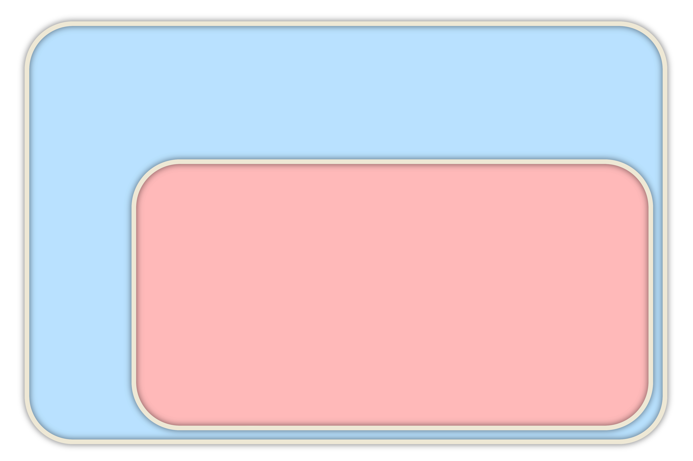

<section data-background-image="images/solar-system.png" data-background-size="contain">
</section>
<section>

```c++ [11|17-21]
template <std::ranges::view TBase> requires std::ranges::forward_range<TBase>
class all_pairs_view :
	public std::ranges::view_interface<all_pairs_view<TBase>>
{
private:
	TBase _vw;
	class inner_iterator { /* ... */ };
	class inner_sentinel { /* ... */ };
	class inner_view { /* ... */ };
 
	class outer_iterator { /* ... */ };
 
public:
	using iterator = outer_iterator;
 
	all_pairs_view() = default;
	constexpr all_pairs_view(TBase vw);
 
	[[nodiscard]] constexpr iterator begin() const;
	[[nodiscard]] constexpr iterator end() const;
};
```

</section>
<section>

```c++ [|19-20]
template <std::ranges::view TBase> requires std::ranges::forward_range<TBase>
class all_pairs_view :
	public std::ranges::view_interface<all_pairs_view<TBase>>
{
    /* ... */
	constexpr all_pairs_view(TBase vw) : _vw{ std::move(vw) } { }

	[[nodiscard]] constexpr iterator begin() const
	{
		return { *this, std::ranges::begin(_vw) };
	}

	[[nodiscard]] constexpr iterator end() const
	{
		return { *this, std::ranges::end(_vw) };
	}
};

template <class Rng>
all_pairs_view(Rng&&) -> all_pairs_view<std::views::all_t<Rng>>;
```

</section>
<section>

<div class="hl-block pretty-big-text">What about the piping operator?</div>

<br />

```c++ [2]
using namespace std::views;
for (int i : iota(2) | filter(even) | transform(square))
	std::cout << i << ' ';
```

</section>
<section>

<div class="hl-block">

## The piping operator isn't done. 

<br/>

### P2387 proposes a fix for C++23.

</div>

</section>

<section>

```c++ [1-2|4-7|4|5-7]
std::vector<int> v{ 1, 2, 3, 4 };
auto even = [](int i){ return i % 2 == 0; };

auto e1 = std::ranges::filter_view{ v, even };
auto e2 = v | std::views::filter(even);
auto e3 = std::views::filter(v, even);
auto e4 = std::views::filter(even)(v);
```

</section>

<section>

<div class="hl-block left-align">

### Range Adaptor Closure Objects [24.7.1.1]

A _range adaptor closure object_ is a <span class="fragment hl-text" data-fragment-index="1">unary function object that accepts a 
`viewable_range` argument and returns a `view`</span>. For a range adaptor closure object `C` and an expression `R` such 
that `decltype((R))` models `viewable_range`, the following expressions are equivalent and yield a `view`:

- <span class="fragment hl-text" data-fragment-index="2">`C(R)`</span>
- <span class="fragment hl-text" data-fragment-index="2">`R | C`</span>

</div>

</section>
<section>
<div class="hl-block left-align">

### Range Adaptor Closure Objects [24.7.1.1]

Given an additional range adaptor closure object `D`, the expression <code>C&nbsp;|&nbsp;D</code> is well-formed and
<span class="fragment hl-text" data-fragment-index="1">produces another range adaptor closure object</span> such that 
the following two expressions are equivalent:

- <span class="fragment hl-text" data-fragment-index="2">`R | C | D`</span>
- <span class="fragment hl-text" data-fragment-index="2">`R | (C | D)`</span>

</div>

</section>
<section>

<div class="hl-block left-align">

### Range Adaptor Objects [24.7.1.2-4]

A _range adaptor object_ is a customization point object that <span class="fragment hl-text">accepts a `viewable_range` 
as its first argument and returns a `view`.</span>

</div>

</section>
<section>

<div class="hl-block left-align">

### Range Adaptor Objects [24.7.1.2-4]

<span class="fragment hl-text" data-fragment-index="1">If a range adaptor object accepts only one argument, then it is a 
range adaptor closure object.</span>

If a range adaptor object accepts more than one argument, then the following expressions are equivalent:

- `adaptor(range, args...)`
- `adaptor(args...)(range)`
- `range | adaptor(args...)`

<span class="fragment hl-text" data-fragment-index="3">In this case, `adaptor(args...)` is a range adaptor closure object.</span>

</div>

</section>
<section>

<div class="hl-block left-align">

### Intuition:

A **range adaptor object** is something which _can_ produce a view. It needs a range and maybe other arguments.

A **range adaptor _closure_ object** is "ready" to wrap a range in a view. All it's missing is a range. 

Closure objects compose together into other closure objects.

</div>

</section>
<section style="color: #EEE8D5; text-shadow: 0 0 7px #000000A0;">



<div class="diag" style="top: 50px; left: 190px;"><h5 style="text-shadow: none;">Range Adaptor Objects:</h5></div>

<div class="diag fragment" data-fragment-index="1" style="top: 140px; left: 230px;"><code>filter;</code></div>
<div class="diag fragment" data-fragment-index="1" style="top: 160px; left: 450px;"><code>transform;</code></div>
<div class="diag fragment" data-fragment-index="1" style="top: 120px; left: 680px;"><code><i>multiparam_adaptor;</i></code></div>

<div class="diag" style="top: 270px; left: 350px;"><h5 style="text-shadow: none;">Range Adaptor Closure Objects:</h5></div>

<div class="diag fragment" style="top: 350px; left: 380px;"><code><i>uniparam_adaptor;</i></code></div>
<div class="diag fragment" style="top: 400px; left: 780px;"><code>filter(<i>lambda</i>);</code></div>
<div class="diag fragment" style="top: 470px; left: 400px;"><code><i>multiparam_adaptor(extra_params...);</i></code></div>
<div class="diag fragment" style="top: 560px; left: 450px;"><code>reverse | transform(<i>lambda</i>);</code></div>

</section>
<section>

<pre><code class="cpp" data-noescape data-trim data-line-numbers="|3-6|8-10|3-4,8-10|12-13">
using namespace std::views;

// a through c are "Range Adaptor Closure Objects":
auto a = reverse;
auto b = filter(<i>some_func</i>);
auto c = filter(<i>some_func</i>) | reverse;

// d and e are "Range Adaptor Objects":
auto d = reverse;
auto e = filter;

// f is a view:
auto f = <i>some_vector</i> | filter(<i>some_func</i>) | reverse;

</code>
</pre>

</section>
