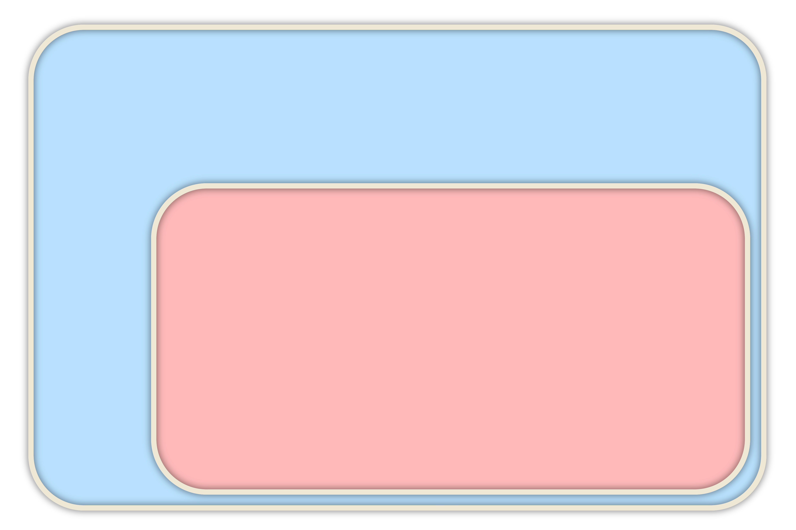

<section data-background-image="images/solar-system.png" data-background-size="contain">
</section>
<section>

<div class="hl-block pretty-big-text">What about the piping operator?</div>

<br />

```c++ [2]
using namespace std::views;
for (int i : iota(2) | filter(even) | transform(square))
	std::cout << i << ' ';
```

</section>
<section>

<div class="hl-block">

## The piping operator isn't done. 

<br/>

### P2387 proposes a fix for C++23.

</div>

</section>
<section>

<div class="hl-block left-align">

### Range Adaptor Closure Objects [24.7.1.1]

A _range adaptor closure object_ is a <span class="fragment hl-text">unary function object that accepts a 
`viewable_range` argument and returns a `view`</span>. For a range adaptor closure object `C` and an expression `R` such 
that `decltype((R))` models `viewable_range`, the following expressions are equivalent and yield a `view`:

- `C(R)`
- `R | C`

</div>

</section>
<section>
<div class="hl-block left-align">

### Range Adaptor Closure Objects [24.7.1.1]

Given an additional range adaptor closure object `D`, the expression <code>C&nbsp;|&nbsp;D</code> is well-formed and 
produces another range adaptor closure object such that the following two expressions are equivalent:

- `R | C | D`
- `R | (C | D)`

</div>

</section>
<section>

<div class="hl-block left-align">

### Range Adaptor Objects [24.7.1.2-4]

A _range adaptor object_ is a customization point object that accepts a `viewable_range` as its
first argument and returns a `view`.

</div>

</section>
<section>

<div class="hl-block left-align">

### Range Adaptor Objects [24.7.1.2-4]

If a range adaptor object accepts only one argument, then it is a range adaptor closure object.

If a range adaptor object accepts more than one argument, then the following expressions are equivalent:

- `adaptor(range, args...)`
- `adaptor(args...)(range)`
- `range | adaptor(args...)`

In this case, `adaptor(args...)` is a range adaptor closure object.

</div>

</section>
<section>

<pre><code class="cpp" data-noescape data-trim data-line-numbers="|3-6|8-10|3-4,8-10|12-13">
using namespace std::views;

// a through c are "Range Adaptor Closure Objects":
auto a = reverse;
auto b = filter(<i>some_func</i>);
auto c = filter(<i>some_func</i>) | reverse;

// d and e are "Range Adaptor Objects":
auto d = reverse;
auto e = filter;

// f is a view:
auto f = <i>some_vector</i> | filter(<i>some_func</i>) | reverse;

</code>
</pre>

</section>
<section style="color: #EEE8D5; text-shadow: 0 0 7px #000000A0;">



<div class="diag" style="top: 50px; left: 190px;"><h5 style="text-shadow: none;">Range Adaptor Objects:</h5></div>

<div class="diag fragment" data-fragment-index="1" style="top: 140px; left: 230px;"><code>filter;</code></div>
<div class="diag fragment" data-fragment-index="1" style="top: 160px; left: 450px;"><code>transform;</code></div>
<div class="diag fragment" data-fragment-index="1" style="top: 120px; left: 680px;"><code><i>multiparam_adaptor;</i></code></div>

<div class="diag" style="top: 270px; left: 350px;"><h5 style="text-shadow: none;">Range Adaptor Closure Objects:</h5></div>

<div class="diag fragment" style="top: 350px; left: 380px;"><code><i>uniparam_adaptor;</i></code></div>
<div class="diag fragment" style="top: 400px; left: 780px;"><code>filter(<i>lambda</i>);</code></div>
<div class="diag fragment" style="top: 470px; left: 400px;"><code><i>multiparam_adaptor(extra_params...);</i></code></div>
<div class="diag fragment" style="top: 560px; left: 450px;"><code>reverse | transform(<i>lambda</i>);</code></div>

</section>
